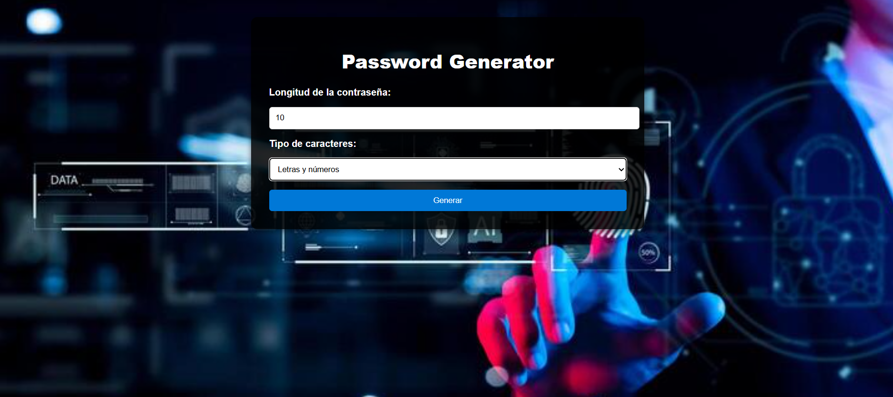
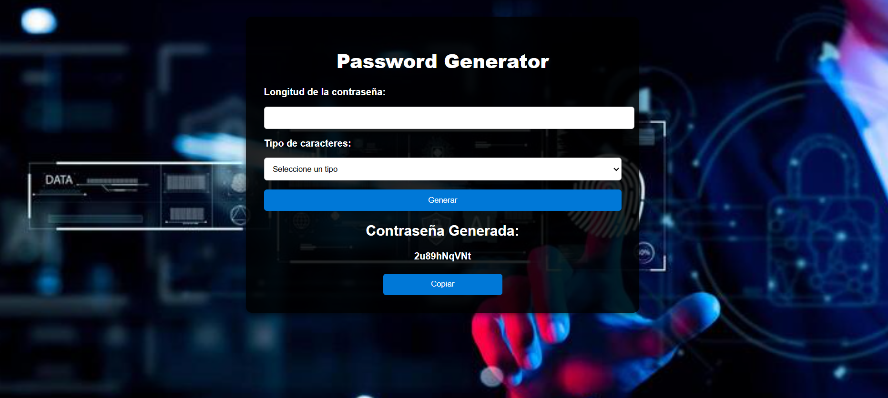
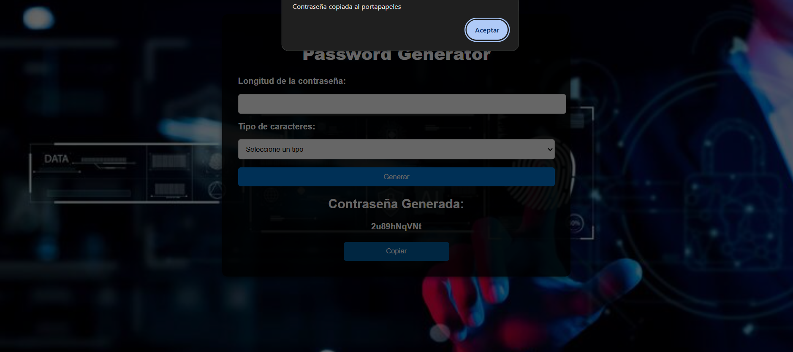

# 🔐 Password Generator

Aplicación sencilla desarrollada con **Laravel 12.41.1** y **PHP 8.4** que permite generar contraseñas aleatorias personalizadas según longitud y tipo de caracteres.  
El proyecto utiliza **Laravel Herd** como servidor local.

---

## 📸 Capturas de pantalla

A continuación se muestran algunas imágenes de la interfaz de la aplicación:

### Pantalla principal

### Contraseña generada

### Botón de copiar

## 🚀 Características

- Generación de contraseñas aleatorias.
- Tipos de caracteres disponibles:
  - Solo letras (mayúsculas y minúsculas).
  - Solo números.
  - Letras y números (alfa-numéricas).
- Validación de longitud (mínimo 4, máximo 64).
- Interfaz simple y moderna con CSS.
- Función para copiar la contraseña al portapapeles.

---

## 🛠️ Tecnologías utilizadas

- **PHP 8.4**
- **Laravel 12.41.1**
- **Laravel Herd** (servidor local)
- **Blade Templates** (HTML integrado con Laravel)
- **CSS personalizado**
- **JavaScript** (para copiar contraseñas)

---

### Clona el repositorio:
   
   git clone https://github.com/Fon-87/password-generator.git

---

## 📜 Licencia

Este proyecto está bajo la licencia [MIT](https://opensource.org/licenses/MIT).

El framework **Laravel** también es software open‑source con licencia MIT.

